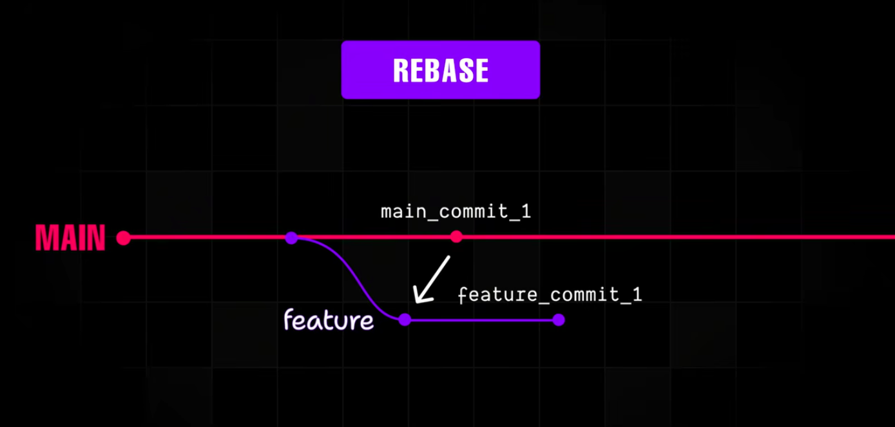
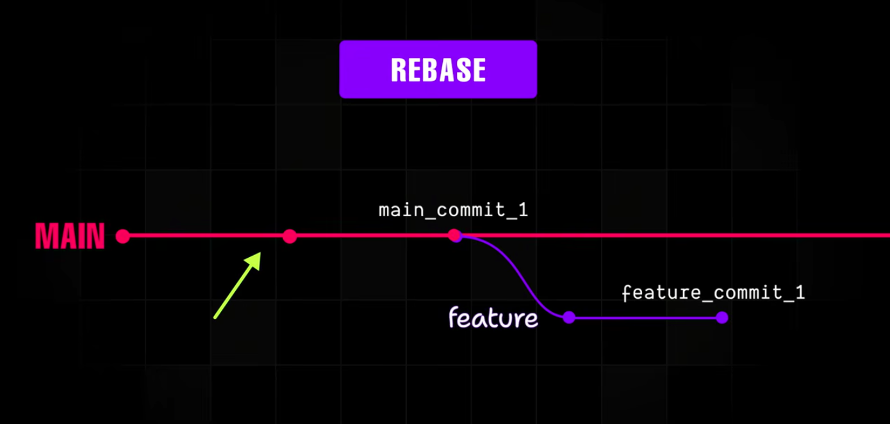
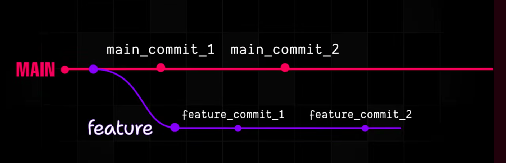
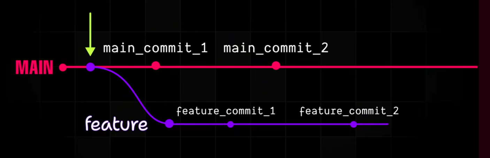
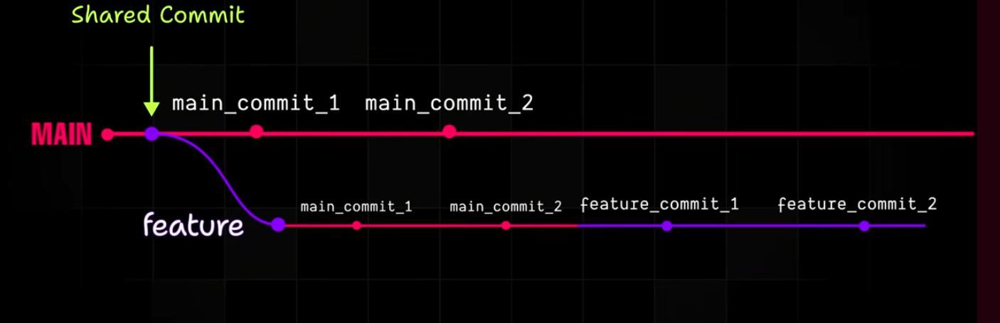
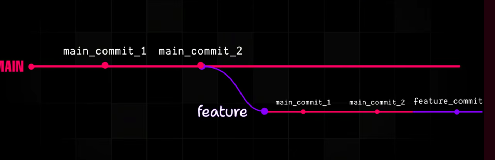

# Git
See https://www.youtube.com/watch?v=mAFoROnOfHs

## Course

### Create local repository
From a newly created folder tell git this is the working directory 
```bash
git init
hint: Using 'master' as the name for the initial branch. This default branch name
hint: is subject to change. To configure the initial branch name to use in all
hint: of your new repositories, which will suppress this warning, call:
hint: 
hint: 	git config --global init.defaultBranch <name>
hint: 
hint: Names commonly chosen instead of 'master' are 'main', 'trunk' and
hint: 'development'. The just-created branch can be renamed via this command:
hint: 
hint: 	git branch -m <name>
Initialized empty Git repository in /home/bvpelt/Develop/git-one/.git/
```

The working directory is created and stored in a .git directory
```bash
ls -la
total 24
drwxrwxr-x  4 bvpelt bvpelt 4096 Mar  4 18:47 .
drwxrwxr-x 28 bvpelt bvpelt 4096 Mar  4 18:43 ..
drwxrwxr-x  7 bvpelt bvpelt 4096 Mar  4 18:47 .git
drwxrwxr-x  2 bvpelt bvpelt 4096 Mar  4 18:45 myFolder
-rw-rw-r--  1 bvpelt bvpelt    4 Mar  4 18:45 one.txt
-rw-rw-r--  1 bvpelt bvpelt    4 Mar  4 18:45 two.txt
```

### Create remote repository
In github create new repository with name git-journey and add two files one.txt with content one and two.txt with content two.

Clone repository to get content local

```bash
git clone git@github.com:bvpelt/git-journey.git
```

### Check changes
In the git-journey directory add 1 on a new line in the one.txt file.
To check if git noticed any changes type

```bash
git status
On branch main
Your branch is up to date with 'origin/main'.

Changes not staged for commit:
  (use "git add <file>..." to update what will be committed)
  (use "git restore <file>..." to discard changes in working directory)
    modified:   one.txt

no changes added to commit (use "git add" and/or "git commit -a")
```

Also change two.txt add 2 on a new line. Check the modification status

```bash
git status
On branch main
Your branch is up to date with 'origin/main'.

Changes not staged for commit:
  (use "git add <file>..." to update what will be committed)
  (use "git restore <file>..." to discard changes in working directory)
    modified:   one.txt
    modified:   two.txt

no changes added to commit (use "git add" and/or "git commit -a")
```

Moving changes from working directory to staging area

```bash
git add .
```

Create new directy myFolder with in that folder a file three.txt and content three. Go back to the project directory and check the changes

```bash
git status
On branch main
Your branch is up to date with 'origin/main'.

Changes to be committed:
  (use "git restore --staged <file>..." to unstage)
    modified:   one.txt
    modified:   two.txt

Untracked files:
  (use "git add <file>..." to include in what will be committed)
    myFolder/
```

Add all changes from local working directory to staging area

```bash
git add --all
```

Check current status

```bash
git status
On branch main
Your branch is up to date with 'origin/main'.

Changes to be committed:
  (use "git restore --staged <file>..." to unstage)
    new file:   myFolder/three.txt
    modified:   one.txt
    modified:   two.txt
```

Go back to previous state
```bash
 git reset
Unstaged changes after reset:
M	one.txt
M	two.txt
```
Check current state

```bash
git status
On branch main
Your branch is up to date with 'origin/main'.

Changes not staged for commit:
  (use "git add <file>..." to update what will be committed)
  (use "git restore <file>..." to discard changes in working directory)
    modified:   one.txt
    modified:   two.txt

Untracked files:
  (use "git add <file>..." to include in what will be committed)
    myFolder/

no changes added to commit (use "git add" and/or "git commit -a")

```

Add all changes ```git add --all``` or ```git add -A```

```bash
git add -A
git status
On branch main
Your branch is up to date with 'origin/main'.

Changes to be committed:
  (use "git restore --staged <file>..." to unstage)
    new file:   myFolder/three.txt
    modified:   one.txt
    modified:   two.txt
```

reset ```git reset```

Add all changes using ```git add .```
```bash
git add .
git status
On branch main
Your branch is up to date with 'origin/main'.

Changes to be committed:
  (use "git restore --staged <file>..." to unstage)
    new file:   myFolder/three.txt
    modified:   one.txt
    modified:   two.txt

```
Although it looks the same there is a difference.


```bash
git reset
Unstaged changes after reset:
M	one.txt
M	two.txt
git status
On branch main
Your branch is up to date with 'origin/main'.

Changes not staged for commit:
  (use "git add <file>..." to update what will be committed)
  (use "git restore <file>..." to discard changes in working directory)
    modified:   one.txt
    modified:   two.txt

Untracked files:
  (use "git add <file>..." to include in what will be committed)
    myFolder/

no changes added to commit (use "git add" and/or "git commit -a")

cd myFolder/
git add .
git status
On branch main
Your branch is up to date with 'origin/main'.

Changes to be committed:
  (use "git restore --staged <file>..." to unstage)
    new file:   three.txt

Changes not staged for commit:
  (use "git add <file>..." to update what will be committed)
  (use "git restore <file>..." to discard changes in working directory)
    modified:   ../one.txt
    modified:   ../two.txt

```

Stage each file, use: ```git add --all``` or ```git add -A```

Stage files only from the current directory use: ```git add .```

Add all files to the staging area

```bash
cd ..
git add --all
git status
On branch main
Your branch is up to date with 'origin/main'.

Changes to be committed:
  (use "git restore --staged <file>..." to unstage)
    new file:   myFolder/three.txt
    modified:   one.txt
    modified:   two.txt
```

Change a filename

```bash
mv two.txt four.txt
ls
four.txt  myFolder  one.txt
git status
On branch main
Your branch is up to date with 'origin/main'.

Changes to be committed:
  (use "git restore --staged <file>..." to unstage)
    new file:   myFolder/three.txt
    modified:   one.txt
    modified:   two.txt

Changes not staged for commit:
  (use "git add/rm <file>..." to update what will be committed)
  (use "git restore <file>..." to discard changes in working directory)
    deleted:    two.txt

Untracked files:
  (use "git add <file>..." to include in what will be committed)
    four.txt


git add * # only stages new or modified files not deleted ones
git status
On branch main
Your branch is up to date with 'origin/main'.

Changes to be committed:
  (use "git restore --staged <file>..." to unstage)
    new file:   four.txt
    new file:   myFolder/three.txt
    modified:   one.txt
    modified:   two.txt

Changes not staged for commit:
  (use "git add/rm <file>..." to update what will be committed)
  (use "git restore <file>..." to discard changes in working directory)
    deleted:    two.txt

# go back to previous state
git reset
Unstaged changes after reset:
M	one.txt
D	two.txt
git status
On branch main
Your branch is up to date with 'origin/main'.

Changes not staged for commit:
  (use "git add/rm <file>..." to update what will be committed)
  (use "git restore <file>..." to discard changes in working directory)
    modified:   one.txt
    deleted:    two.txt

Untracked files:
  (use "git add <file>..." to include in what will be committed)
    four.txt
    myFolder/

no changes added to commit (use "git add" and/or "git commit -a")

# One can move only a specific file to the staging area

git add two.txt
git status
On branch main
Your branch is up to date with 'origin/main'.

Changes to be committed:
  (use "git restore --staged <file>..." to unstage)
    deleted:    two.txt

Changes not staged for commit:
  (use "git add <file>..." to update what will be committed)
  (use "git restore <file>..." to discard changes in working directory)
    modified:   one.txt

Untracked files:
  (use "git add <file>..." to include in what will be committed)
    four.txt
    myFolder/

# Go back to previous state

git reset
Unstaged changes after reset:
M	one.txt
D	two.txt

# Add files by extension
git status
On branch main
Your branch is up to date with 'origin/main'.

Changes to be committed:
  (use "git restore --staged <file>..." to unstage)
    new file:   four.txt
    modified:   one.txt

Changes not staged for commit:
  (use "git add/rm <file>..." to update what will be committed)
  (use "git restore <file>..." to discard changes in working directory)
    deleted:    two.txt

Untracked files:
  (use "git add <file>..." to include in what will be committed)
    myFolder/

# The best way to add all files to the working area
git add . # from top directory
git status
On branch main
Your branch is up to date with 'origin/main'.

Changes to be committed:
  (use "git restore --staged <file>..." to unstage)
    renamed:    two.txt -> four.txt
    new file:   myFolder/three.txt
    modified:   one.txt


```

| Command       | Description                                                                          |
|---------------|--------------------------------------------------------------------------------------|
| git add --all | add all files from working area to the staging area                                  |
| git add -A    | add all files from working area to the staging area                                  |
| git add .     | add all files from the current directory of the working area to the staging area     |
| git add *     | add all new or modified files form the working area to the staging area              |
| git add *.txt | add all files with the specified extension from the working area to the staging area |

### Commits

Move changes from the staging area to the local repository

```bash
git status
On branch main
Your branch is up to date with 'origin/main'.

Changes to be committed:
  (use "git restore --staged <file>..." to unstage)
    renamed:    two.txt -> four.txt
    new file:   myFolder/three.txt
    modified:   one.txt

git commit -m "my changes"
[main 61ccf76] my changes
 3 files changed, 3 insertions(+)
 rename two.txt => four.txt (66%)
 create mode 100644 myFolder/three.txt

git status
On branch main
Your branch is ahead of 'origin/main' by 1 commit.
  (use "git push" to publish your local commits)

nothing to commit, working tree clean

# Reset to previous state
git reset HEAD~
Unstaged changes after reset:
M	one.txt
D	two.txt

git status
On branch main
Your branch is up to date with 'origin/main'.

Changes not staged for commit:
  (use "git add/rm <file>..." to update what will be committed)
  (use "git restore <file>..." to discard changes in working directory)
    modified:   one.txt
    deleted:    two.txt

Untracked files:
  (use "git add <file>..." to include in what will be committed)
    four.txt
    myFolder/

no changes added to commit (use "git add" and/or "git commit -a")

# Add files to staging area again
git add .
git commit -m "I have made some changes to the files"
[main f766ab7] I have made some changes to the files
 3 files changed, 3 insertions(+)
 rename two.txt => four.txt (66%)
 create mode 100644 myFolder/three.txt

# Remove one.txt
rm one.txt 
git status
On branch main
Your branch is ahead of 'origin/main' by 1 commit.
  (use "git push" to publish your local commits)

Changes not staged for commit:
  (use "git add/rm <file>..." to update what will be committed)
  (use "git restore <file>..." to discard changes in working directory)
    deleted:    one.txt

no changes added to commit (use "git add" and/or "git commit -a")

# Stage deletion
git add .
git status
On branch main
Your branch is ahead of 'origin/main' by 1 commit.
  (use "git push" to publish your local commits)

Changes to be committed:
  (use "git restore --staged <file>..." to unstage)
    deleted:    one.txt

# Remove local file and file in staging area ready for commit
ls
four.txt  myFolder

git rm four.txt
rm 'four.txt'
git status
On branch main
Your branch is ahead of 'origin/main' by 1 commit.
  (use "git push" to publish your local commits)

Changes to be committed:
  (use "git restore --staged <file>..." to unstage)
    deleted:    four.txt
    deleted:    one.txt

bvpelt@uranus:~/Develop/git-journey$ ls
myFolder

# Reset only the staged changes, not the actual files
git reset
Unstaged changes after reset:
D	four.txt
D	one.txt

git status
On branch main
Your branch is ahead of 'origin/main' by 1 commit.
  (use "git push" to publish your local commits)

Changes not staged for commit:
  (use "git add/rm <file>..." to update what will be committed)
  (use "git restore <file>..." to discard changes in working directory)
    deleted:    four.txt
    deleted:    one.txt

no changes added to commit (use "git add" and/or "git commit -a")

# reset changes and files
git reset --hard
HEAD is now at f766ab7 I have made some changes to the files

ls
four.txt  myFolder  one.txt

git status
On branch main
Your branch is ahead of 'origin/main' by 1 commit.
  (use "git push" to publish your local commits)

nothing to commit, working tree clean

# change content of four.txt and try to remove it afterward
git rm four.txt 
error: the following file has local modifications:
    four.txt
(use --cached to keep the file, or -f to force removal)

#
# to change it
# - first commit it then remove it
# - or use -f flag

git rm -f four.txt 
rm 'four.txt'

git status
On branch main
Your branch is ahead of 'origin/main' by 1 commit.
  (use "git push" to publish your local commits)

Changes to be committed:
  (use "git restore --staged <file>..." to unstage)
    deleted:    four.txt


# hard reset
git reset --hard
HEAD is now at f766ab7 I have made some changes to the files
bvpelt@uranus:~/Develop/git-journey$ ls
four.txt  myFolder  one.txt


# cached reset
bvpelt@uranus:~/Develop/git-journey$ cat four.txt 
two
2
# Change content of four.txt to "hello"
git rm --cached four.txt 
rm 'four.txt'
bvpelt@uranus:~/Develop/git-journey$ cat four.txt 
hello
bvpelt@uranus:~/Develop/git-journey$ git status
On branch main
Your branch is ahead of 'origin/main' by 1 commit.
  (use "git push" to publish your local commits)

Changes to be committed:
  (use "git restore --staged <file>..." to unstage)
    deleted:    four.txt

Untracked files:
  (use "git add <file>..." to include in what will be committed)
    four.txt

# Now four.txt is deleted from staging area and is moved to untracked section. The file still exists in the system.

```

| command            | description                                   |
|--------------------|-----------------------------------------------|
| git rm --force     | completely deletes the file                   |
| git rm --cached    | only remove file form staging area            |
| git rm -r <folder> | removes files recursive from specified folder |

```bash
bvpelt@uranus:~/Develop/git-journey$ git reset --hard
HEAD is now at f766ab7 I have made some changes to the files
bvpelt@uranus:~/Develop/git-journey$ git status
On branch main
Your branch is ahead of 'origin/main' by 1 commit.
  (use "git push" to publish your local commits)

nothing to commit, working tree clean
bvpelt@uranus:~/Develop/git-journey$ ls
four.txt  myFolder  one.txt

# Using git rm -r

bvpelt@uranus:~/Develop/git-journey$ git rm -r myFolder/
rm 'myFolder/three.txt'
bvpelt@uranus:~/Develop/git-journey$ git status
On branch main
Your branch is ahead of 'origin/main' by 1 commit.
  (use "git push" to publish your local commits)

Changes to be committed:
  (use "git restore --staged <file>..." to unstage)
    deleted:    myFolder/three.txt

```

### View commits

```bash
git log
commit f766ab7d80c4d9c09c0c3e19dc17238a25b7b8fe (HEAD -> main)
Author: Bart van Pelt <bart.vanpelt@gmail.com>
Date:   Fri Mar 6 14:50:55 2026 +0100

    I have made some changes to the files

commit ccfdfd3451c87f4cca421dbf5615b9c598dd8755 (origin/main, origin/HEAD)
Author: Bart van Pelt <bart.vanpelt@gmail.com>
Date:   Wed Mar 4 18:55:53 2026 +0100

    Add new file two.txt with initial content

commit 1cec9eaee1199803eec72669fea7edec1b76cd36
Author: Bart van Pelt <bart.vanpelt@gmail.com>
Date:   Wed Mar 4 18:54:52 2026 +0100

    Add one.txt with initial content 'one'

# Short version
bvpelt@uranus:~/Develop/git-journey$ git log --oneline 
f766ab7 (HEAD -> main) I have made some changes to the files
ccfdfd3 (origin/main, origin/HEAD) Add new file two.txt with initial content
1cec9ea Add one.txt with initial content 'one'

```

### Branching

For working with software, the main branch contains the stable version. Changes are made in a development branch. When changes are good/complete they can be merged into the main branch.

```bash
# show branches

bvpelt@uranus:~/Develop/git-journey$ git branch
* main

# create new branch
bvpelt@uranus:~/Develop/git-journey$ git branch development
bvpelt@uranus:~/Develop/git-journey$ git branch
  development
* main

# The star before main means you are still in the main branch
# The newly created branch (development) contains the state of the orignal branch (main) you were in.

# activate the development branch
bvpelt@uranus:~/Develop/git-journey$ git checkout development
Switched to branch 'development'
bvpelt@uranus:~/Develop/git-journey$ git branch
* development
  main

bvpelt@uranus:~/Develop/git-journey$  git status
On branch development
nothing to commit, working tree clean

# make change (new file with content)
bvpelt@uranus:~/Develop/git-journey$ touch three.txt
bvpelt@uranus:~/Develop/git-journey$ vi three.txt 
bvpelt@uranus:~/Develop/git-journey$ git status
On branch development
Untracked files:
  (use "git add <file>..." to include in what will be committed)
    three.txt

nothing added to commit but untracked files present (use "git add" to track)

# add three.txt to staging area. First add file from working directory to working area, then move it to staging area
bvpelt@uranus:~/Develop/git-journey$ git add .
bvpelt@uranus:~/Develop/git-journey$ git commit -m "I created three.txt and entered three there"
[development 56adcc9] I created three.txt and entered three there
 1 file changed, 1 insertion(+)
 create mode 100644 three.txt
bvpelt@uranus:~/Develop/git-journey$ git status
On branch development
nothing to commit, working tree clean

# switch to main and make change
bvpelt@uranus:~/Develop/git-journey$ git checkout main
Switched to branch 'main'
Your branch is ahead of 'origin/main' by 1 commit.
  (use "git push" to publish your local commits)
bvpelt@uranus:~/Develop/git-journey$ ls
four.txt  myFolder  one.txt
bvpelt@uranus:~/Develop/git-journey$ cat four.txt 
two
2
bvpelt@uranus:~/Develop/git-journey$ vi four.txt
bvpelt@uranus:~/Develop/git-journey$ cat four.txt
four
4

bvpelt@uranus:~/Develop/git-journey$ git status
On branch main
Your branch is ahead of 'origin/main' by 1 commit.
  (use "git push" to publish your local commits)

Changes not staged for commit:
  (use "git add <file>..." to update what will be committed)
  (use "git restore <file>..." to discard changes in working directory)
    modified:   four.txt

no changes added to commit (use "git add" and/or "git commit -a")

bvpelt@uranus:~/Develop/git-journey$ git add .
bvpelt@uranus:~/Develop/git-journey$ git commit -m "I changed four.txt and added four/4"
[main 3381d04] I changed four.txt and added four/4
 1 file changed, 2 insertions(+), 2 deletions(-)
bvpelt@uranus:~/Develop/git-journey$ git status
On branch main
Your branch is ahead of 'origin/main' by 2 commits.
  (use "git push" to publish your local commits)

nothing to commit, working tree clean

# merge changes
# first merge main into development
bvpelt@uranus:~/Develop/git-journey$ ls
four.txt  myFolder  one.txt
bvpelt@uranus:~/Develop/git-journey$ git checkout development
Switched to branch 'development'
bvpelt@uranus:~/Develop/git-journey$ ls
four.txt  myFolder  one.txt  three.txt
bvpelt@uranus:~/Develop/git-journey$ cat four.txt
two
2
bvpelt@uranus:~/Develop/git-journey$ cat three.txt
three


bvpelt@uranus:~/Develop/git-journey$ git merge main -m "Merging main into development"
Merge made by the 'ort' strategy.
 four.txt | 4 ++--
 1 file changed, 2 insertions(+), 2 deletions(-)
bvpelt@uranus:~/Develop/git-journey$ cat four.txt 
four
4
bvpelt@uranus:~/Develop/git-journey$ git status
On branch development
nothing to commit, working tree clean

# merge changes from development to main
bvpelt@uranus:~/Develop/git-journey$ git checkout main
Switched to branch 'main'
Your branch is ahead of 'origin/main' by 2 commits.
  (use "git push" to publish your local commits)
bvpelt@uranus:~/Develop/git-journey$ ls
four.txt  myFolder  one.txt
bvpelt@uranus:~/Develop/git-journey$ git merge development -m "Merging on main with development"
Updating 3381d04..2a0a48d
Fast-forward (no commit created; -m option ignored)
 three.txt | 1 +
 1 file changed, 1 insertion(+)
 create mode 100644 three.txt
bvpelt@uranus:~/Develop/git-journey$ ls
four.txt  myFolder  one.txt  three.txt
bvpelt@uranus:~/Develop/git-journey$ git status
On branch main
Your branch is ahead of 'origin/main' by 4 commits.
  (use "git push" to publish your local commits)

nothing to commit, working tree clean
bvpelt@uranus:~/Develop/git-journey$ ls
four.txt  myFolder  one.txt  three.txt


# Merging conflicts

bvpelt@uranus:~/Develop/git-journey$ git branch staging
bvpelt@uranus:~/Develop/git-journey$ git branch
  development
* main
  staging
bvpelt@uranus:~/Develop/git-journey$ git checkout staging
Switched to branch 'staging'
bvpelt@uranus:~/Develop/git-journey$ git branch
  development
  main
* staging
bvpelt@uranus:~/Develop/git-journey$ ls
four.txt  myFolder  one.txt  three.txt
bvpelt@uranus:~/Develop/git-journey$ vi four.txt 
bvpelt@uranus:~/Develop/git-journey$ cat four.txt 
four
44

bvpelt@uranus:~/Develop/git-journey$ git status
On branch staging
Changes not staged for commit:
  (use "git add <file>..." to update what will be committed)
  (use "git restore <file>..." to discard changes in working directory)
    modified:   four.txt

no changes added to commit (use "git add" and/or "git commit -a")

bvpelt@uranus:~/Develop/git-journey$ git add .
bvpelt@uranus:~/Develop/git-journey$ git commit -m "changed 44"
[staging 2bbdd85] changed 44
 1 file changed, 1 insertion(+), 1 deletion(-)
bvpelt@uranus:~/Develop/git-journey$ git status
On branch staging
nothing to commit, working tree clean
bvpelt@uranus:~/Develop/git-journey$ cat four.txt 
four
44

# setup change with merge conflict
bvpelt@uranus:~/Develop/git-journey$ git checkout development
Switched to branch 'development'
bvpelt@uranus:~/Develop/git-journey$ cat four.txt 
four
4
bvpelt@uranus:~/Develop/git-journey$ vi four.txt 
bvpelt@uranus:~/Develop/git-journey$ cat four.txt 
four
444
bvpelt@uranus:~/Develop/git-journey$ git add .
bvpelt@uranus:~/Develop/git-journey$ git commit -m "added 444 on four.txt"
[development 9a6d0c7] added 444 on four.txt
 1 file changed, 1 insertion(+), 1 deletion(-)
bvpelt@uranus:~/Develop/git-journey$ git status
On branch development
nothing to commit, working tree clean


bvpelt@uranus:~/Develop/git-journey$ git merge staging 
Auto-merging four.txt
CONFLICT (content): Merge conflict in four.txt
Automatic merge failed; fix conflicts and then commit the result.

bvpelt@uranus:~/Develop/git-journey$ cat four.txt 
four
<<<<<<< HEAD
444
=======
44
>>>>>>> staging

# manually resolve merge conflict
bvpelt@uranus:~/Develop/git-journey$ vi four.txt 
bvpelt@uranus:~/Develop/git-journey$ cat four.txt 
four
444
bvpelt@uranus:~/Develop/git-journey$ git add .
bvpelt@uranus:~/Develop/git-journey$ git commit -m "Merge conflic solved"
[development 829851b] Merge conflic solved
bvpelt@uranus:~/Develop/git-journey$ git status
On branch development
nothing to commit, working tree clean

# since merge conflicts are resolved now development can be merged into staging
bvpelt@uranus:~/Develop/git-journey$ git checkout staging 
Switched to branch 'staging'
bvpelt@uranus:~/Develop/git-journey$ cat four.txt 
four
44
bvpelt@uranus:~/Develop/git-journey$ git merge development
Updating 2bbdd85..829851b
Fast-forward
 four.txt | 2 +-
 1 file changed, 1 insertion(+), 1 deletion(-)
bvpelt@uranus:~/Develop/git-journey$ cat four.txt 
four
444
bvpelt@uranus:~/Develop/git-journey$ git status
On branch staging
nothing to commit, working tree clean

# merge changes to main
bvpelt@uranus:~/Develop/git-journey$ git checkout main
Switched to branch 'main'
Your branch is ahead of 'origin/main' by 4 commits.
  (use "git push" to publish your local commits)
bvpelt@uranus:~/Develop/git-journey$ cat four.txt 
four
4
bvpelt@uranus:~/Develop/git-journey$ ls
four.txt  myFolder  one.txt  three.txt
bvpelt@uranus:~/Develop/git-journey$ git merge staging
Updating 2a0a48d..829851b
Fast-forward
 four.txt | 2 +-
 1 file changed, 1 insertion(+), 1 deletion(-)
bvpelt@uranus:~/Develop/git-journey$ cat four.txt 
four
444
bvpelt@uranus:~/Develop/git-journey$ git status
On branch main
Your branch is ahead of 'origin/main' by 7 commits.
  (use "git push" to publish your local commits)

nothing to commit, working tree clean

# go back to pervious version

bvpelt@uranus:~/Develop/git-journey$ git log --oneline 
829851b (HEAD -> main, staging, development) Merge conflic solved
9a6d0c7 added 444 on four.txt
2bbdd85 changed 44
2a0a48d Merging main into development
3381d04 I changed four.txt and added four/4
56adcc9 I created three.txt and entered three there
f766ab7 I have made some changes to the files
ccfdfd3 (origin/main, origin/HEAD) Add new file two.txt with initial content
1cec9ea Add one.txt with initial content 'one'
bvpelt@uranus:~/Develop/git-journey$ cat one.txt
one
1
bvpelt@uranus:~/Develop/git-journey$ vi one.txt
bvpelt@uranus:~/Develop/git-journey$ git add .
bvpelt@uranus:~/Develop/git-journey$ git commit -m "update one.txt file"
[main 4537fab] update one.txt file
 1 file changed, 1 insertion(+), 1 deletion(-)
bvpelt@uranus:~/Develop/git-journey$ git log --oneline 
4537fab (HEAD -> main) update one.txt file
829851b (staging, development) Merge conflic solved
9a6d0c7 added 444 on four.txt
2bbdd85 changed 44
2a0a48d Merging main into development
3381d04 I changed four.txt and added four/4
56adcc9 I created three.txt and entered three there
f766ab7 I have made some changes to the files
ccfdfd3 (origin/main, origin/HEAD) Add new file two.txt with initial content
1cec9ea Add one.txt with initial content 'one'

# going back to 829851b (staging, development) Merge conflic solved
git checkout 829851b
Note: switching to '829851b'.

You are in 'detached HEAD' state. You can look around, make experimental
changes and commit them, and you can discard any commits you make in this
state without impacting any branches by switching back to a branch.

If you want to create a new branch to retain commits you create, you may
do so (now or later) by using -c with the switch command. Example:

  git switch -c <new-branch-name>

Or undo this operation with:

  git switch -

Turn off this advice by setting config variable advice.detachedHead to false

HEAD is now at 829851b Merge conflic solved

# go back to main branch
bvpelt@uranus:~/Develop/git-journey$ git checkout main
Previous HEAD position was 829851b Merge conflic solved
Switched to branch 'main'
Your branch is ahead of 'origin/main' by 8 commits.
  (use "git push" to publish your local commits)

# compaire commits
git log --oneline
4537fab (HEAD -> main) update one.txt file
829851b (staging, development) Merge conflic solved
9a6d0c7 added 444 on four.txt
2bbdd85 changed 44
2a0a48d Merging main into development
3381d04 I changed four.txt and added four/4
56adcc9 I created three.txt and entered three there
f766ab7 I have made some changes to the files
ccfdfd3 (origin/main, origin/HEAD) Add new file two.txt with initial content
1cec9ea Add one.txt with initial content 'one'

# compaire two latest commits by id

bvpelt@uranus:~/Develop/git-journey$ git status
On branch main
Your branch is ahead of 'origin/main' by 8 commits.
  (use "git push" to publish your local commits)

nothing to commit, working tree clean

bvpelt@uranus:~/Develop/git-journey$ cat one.txt
one
Hello

## compaire newest verses older
git diff 4537fab 829851b
diff --git a/one.txt b/one.txt
index 0b0c124..4846250 100644
--- a/one.txt
+++ b/one.txt
@@ -1,2 +1,2 @@
 one
-Hello
+1

## compaire older verses newest
git diff 829851b 4537fab
diff --git a/one.txt b/one.txt
index 4846250..0b0c124 100644
--- a/one.txt
+++ b/one.txt
@@ -1,2 +1,2 @@
 one
-1
+Hello

## view older one.txt
git checkout 829851b
Note: switching to '829851b'.

You are in 'detached HEAD' state. You can look around, make experimental
changes and commit them, and you can discard any commits you make in this
state without impacting any branches by switching back to a branch.

If you want to create a new branch to retain commits you create, you may
do so (now or later) by using -c with the switch command. Example:

  git switch -c <new-branch-name>

Or undo this operation with:

  git switch -

Turn off this advice by setting config variable advice.detachedHead to false

HEAD is now at 829851b Merge conflic solved
bvpelt@uranus:~/Develop/git-journey$ cat one.txt 
one
1

```
### Remote repository
- from local to remote ```git push```
- from remote to local repository not merging ```git fetch```
- from remote to local repository and merging into the working directory ```git pull```. ```git pull``` is ```git fetch``` + ```git merge```

```bash
# origin refers to the remote repository, main is the branch to push to
bvpelt@uranus:~/Develop/git-journey$ git push origin main
Enumerating objects: 25, done.
Counting objects: 100% (25/25), done.
Delta compression using up to 14 threads
Compressing objects: 100% (15/15), done.
Writing objects: 100% (23/23), 1.99 KiB | 680.00 KiB/s, done.
Total 23 (delta 6), reused 0 (delta 0), pack-reused 0
remote: Resolving deltas: 100% (6/6), done.
To github.com:bvpelt/git-journey.git
   ccfdfd3..4537fab  main -> main

bvpelt@uranus:~/Develop/git-journey$ git status
On branch main
Your branch is up to date with 'origin/main'.

nothing to commit, working tree clean

bvpelt@uranus:~/Develop/git-journey$ git checkout staging 
Switched to branch 'staging'

bvpelt@uranus:~/Develop/git-journey$ git push origin staging
Total 0 (delta 0), reused 0 (delta 0), pack-reused 0
remote: 
remote: Create a pull request for 'staging' on GitHub by visiting:
remote:      https://github.com/bvpelt/git-journey/pull/new/staging
remote: 
To github.com:bvpelt/git-journey.git
 * [new branch]      staging -> staging
# Git has created a new remote branch staging.

bvpelt@uranus:~/Develop/git-journey$ git checkout development 
Switched to branch 'development'
bvpelt@uranus:~/Develop/git-journey$ git push origin development 
Total 0 (delta 0), reused 0 (delta 0), pack-reused 0
remote: 
remote: Create a pull request for 'development' on GitHub by visiting:
remote:      https://github.com/bvpelt/git-journey/pull/new/development
remote: 
To github.com:bvpelt/git-journey.git
 * [new branch]      development -> development
# Git has created a new remote branche development

bvpelt@uranus:~/Develop/git-journey$ git checkout main
Switched to branch 'main'
Your branch is up to date with 'origin/main'.

# In remote repository github.com change three.txt add a line with 3 and commit changes
# The local repository branch main is one commit behind

# from local repository
bvpelt@uranus:~/Develop/git-journey$ cat three.txt 
three
bvpelt@uranus:~/Develop/git-journey$ git fetch 
remote: Enumerating objects: 5, done.
remote: Counting objects: 100% (5/5), done.
remote: Compressing objects: 100% (2/2), done.
remote: Total 3 (delta 1), reused 0 (delta 0), pack-reused 0 (from 0)
Unpacking objects: 100% (3/3), 911 bytes | 911.00 KiB/s, done.
From github.com:bvpelt/git-journey
   4537fab..c0c27ff  main       -> origin/main
bvpelt@uranus:~/Develop/git-journey$ cat three.txt 
three
# The changes are in the local repository but not yet merged

bvpelt@uranus:~/Develop/git-journey$ git merge
Updating 4537fab..c0c27ff
Fast-forward
 three.txt | 1 +
 1 file changed, 1 insertion(+)
bvpelt@uranus:~/Develop/git-journey$ cat three.txt 
three
3
# After merging the changes appear

# In remote repository github.com change three.txt add a line with 333 and commit changes
# The local repository branch main is one commit behind
bvpelt@uranus:~/Develop/git-journey$ cat three.txt
three
3
bvpelt@uranus:~/Develop/git-journey$ git pull
remote: Enumerating objects: 5, done.
remote: Counting objects: 100% (5/5), done.
remote: Compressing objects: 100% (2/2), done.
remote: Total 3 (delta 1), reused 0 (delta 0), pack-reused 0 (from 0)
Unpacking objects: 100% (3/3), 925 bytes | 185.00 KiB/s, done.
From github.com:bvpelt/git-journey
   c0c27ff..6641d44  main       -> origin/main
Updating c0c27ff..6641d44
Fast-forward
 three.txt | 1 +
 1 file changed, 1 insertion(+)
bvpelt@uranus:~/Develop/git-journey$ cat three.txt
three
3
333
# git pull fetches and merges the changes in the working directory

# To set the working directory back to the previous committed state use git restore
# Local uncommitted changes are deleted
bvpelt@uranus:~/Develop/git-journey$ cat one.txt
one
Hello
bvpelt@uranus:~/Develop/git-journey$ echo "New Feature" >> one.txt
bvpelt@uranus:~/Develop/git-journey$ cat one.txt
one
Hello
New Feature
bvpelt@uranus:~/Develop/git-journey$ git restore one.txt
bvpelt@uranus:~/Develop/git-journey$ cat one.txt
one
Hello

# git restore myFolder restores all changes in that directory
# git restore . restores all changes in the current directory (recursive)

# if you already staged files with git add you can restore then using git restore --staged one.txt

# with git stash you can temporarily set aside your unfinished work 
# you can switch to another branch to do work there and later go back to your unfinished work


bvpelt@uranus:~/Develop/git-journey$ cat one.txt 
one
Hello
bvpelt@uranus:~/Develop/git-journey$ echo "Another feature" >> one.txt 
bvpelt@uranus:~/Develop/git-journey$ cat one.txt 
one
Hello
Another feature
bvpelt@uranus:~/Develop/git-journey$ git checkout development
error: Your local changes to the following files would be overwritten by checkout:
    one.txt
Please commit your changes or stash them before you switch branches.
Aborting
bvpelt@uranus:~/Develop/git-journey$ git stash
Saved working directory and index state WIP on main: 6641d44 Add line with number 333 to three.txt
bvpelt@uranus:~/Develop/git-journey$ cat one.txt 
one
Hello
bvpelt@uranus:~/Develop/git-journey$ git checkout development
Switched to branch 'development'
bvpelt@uranus:~/Develop/git-journey$ cat one.txt 
one
1
bvpelt@uranus:~/Develop/git-journey$ git checkout main
Switched to branch 'main'
Your branch is up to date with 'origin/main'.
bvpelt@uranus:~/Develop/git-journey$ cat one.txt 
one
Hello
bvpelt@uranus:~/Develop/git-journey$ git stash pop
On branch main
Your branch is up to date with 'origin/main'.

Changes not staged for commit:
  (use "git add <file>..." to update what will be committed)
  (use "git restore <file>..." to discard changes in working directory)
    modified:   one.txt

no changes added to commit (use "git add" and/or "git commit -a")
Dropped refs/stash@{0} (dfe34425137b6007e5d1611e18b0f5e9e1b15d09)
bvpelt@uranus:~/Develop/git-journey$ cat one.txt 
one
Hello
Another feature

# git stash manages a stash list (stack) with newest on top to oldest
# git stash pop removes newst from stash list. git stash --apply gets changes but state stays on the stash list.

bvpelt@uranus:~/Develop/git-journey$ git stash
Saved working directory and index state WIP on main: 6641d44 Add line with number 333 to three.txt

bvpelt@uranus:~/Develop/git-journey$ git stash apply
On branch main
Your branch is up to date with 'origin/main'.

Changes not staged for commit:
  (use "git add <file>..." to update what will be committed)
  (use "git restore <file>..." to discard changes in working directory)
    modified:   one.txt

no changes added to commit (use "git add" and/or "git commit -a")

bvpelt@uranus:~/Develop/git-journey$ cat one.txt 
one
Hello
Another feature

# Show list of stashed changes
bvpelt@uranus:~/Develop/git-journey$ git stash list
stash@{0}: WIP on main: 6641d44 Add line with number 333 to three.txt

# one could use the identification of a stash item from the list
# git stash pop stash@{0} or git stash apply stash@{0}

# clear the stash list
bvpelt@uranus:~/Develop/git-journey$ git stash drop
Dropped refs/stash@{0} (dc21f93a168e591b2a1396e53de14f342288238b)
bvpelt@uranus:~/Develop/git-journey$ git stash list

# all changes are in our branch
bvpelt@uranus:~/Develop/git-journey$ git status
On branch main
Your branch is up to date with 'origin/main'.

Changes not staged for commit:
  (use "git add <file>..." to update what will be committed)
  (use "git restore <file>..." to discard changes in working directory)
    modified:   one.txt

no changes added to commit (use "git add" and/or "git commit -a")
bvpelt@uranus:~/Develop/git-journey$ cat one.txt 
one
Hello
Another feature

bvpelt@uranus:~/Develop/git-journey$ git stash
Saved working directory and index state WIP on main: 6641d44 Add line with number 333 to three.txt
bvpelt@uranus:~/Develop/git-journey$ cat one.txt 
one
Hello

bvpelt@uranus:~/Develop/git-journey$ git stash list
stash@{0}: WIP on main: 6641d44 Add line with number 333 to three.txt

# restore state from stash
bvpelt@uranus:~/Develop/git-journey$ git stash pop
On branch main
Your branch is up to date with 'origin/main'.

Changes not staged for commit:
  (use "git add <file>..." to update what will be committed)
  (use "git restore <file>..." to discard changes in working directory)
    modified:   one.txt

no changes added to commit (use "git add" and/or "git commit -a")
Dropped refs/stash@{0} (4ae3651864a44207b7d68cc9784dd90f9e02d382)
bvpelt@uranus:~/Develop/git-journey$ cat one.txt 
one
Hello
Another feature
bvpelt@uranus:~/Develop/git-journey$ git stash list


bvpelt@uranus:~/Develop/git-journey$ git stash
Saved working directory and index state WIP on main: 6641d44 Add line with number 333 to three.txt
bvpelt@uranus:~/Develop/git-journey$ cat one.txt 
one
Hello
bvpelt@uranus:~/Develop/git-journey$ git stash list
stash@{0}: WIP on main: 6641d44 Add line with number 333 to three.txt
bvpelt@uranus:~/Develop/git-journey$ git stash apply
On branch main
Your branch is up to date with 'origin/main'.

Changes not staged for commit:
  (use "git add <file>..." to update what will be committed)
  (use "git restore <file>..." to discard changes in working directory)
    modified:   one.txt

no changes added to commit (use "git add" and/or "git commit -a")
bvpelt@uranus:~/Develop/git-journey$ cat one.txt 
one
Hello
Another feature
bvpelt@uranus:~/Develop/git-journey$ git stash list
stash@{0}: WIP on main: 6641d44 Add line with number 333 to three.txt

# Git revert is used to undo changes made in a previous commit but instead of deleting the old commit it creates a new one that reverses those changes
# fixing an old mistake without erasing it from the commit history

bvpelt@uranus:~/Develop/git-journey$ cat three.txt 
three
3
333
bvpelt@uranus:~/Develop/git-journey$ echo "Hello Three" >> three.txt
bvpelt@uranus:~/Develop/git-journey$ cat three.txt 
three
3
333
Hello Three
bvpelt@uranus:~/Develop/git-journey$ git add .
bvpelt@uranus:~/Develop/git-journey$ git commit -m "Hello three"
[main 7a0dd5a] Hello three
 2 files changed, 2 insertions(+)
bvpelt@uranus:~/Develop/git-journey$ git log --oneline
7a0dd5a (HEAD -> main) Hello three
6641d44 (origin/main, origin/HEAD) Add line with number 333 to three.txt
c0c27ff Add a new line to three.txt
4537fab update one.txt file
829851b (origin/staging, origin/development, staging, development) Merge conflic solved
9a6d0c7 added 444 on four.txt
2bbdd85 changed 44
2a0a48d Merging main into development
3381d04 I changed four.txt and added four/4
56adcc9 I created three.txt and entered three there
f766ab7 I have made some changes to the files
ccfdfd3 Add new file two.txt with initial content
1cec9ea Add one.txt with initial content 'one'
bvpelt@uranus:~/Develop/git-journey$ git revert 7a0dd5a
[main a67c65c] Revert "Hello three"
 2 files changed, 2 deletions(-)
bvpelt@uranus:~/Develop/git-journey$ cat three.txt 
three
3
333


bvpelt@uranus:~/Develop/git-journey$ git log --oneline
a67c65c (HEAD -> main) Revert "Hello three"
7a0dd5a Hello three
6641d44 (origin/main, origin/HEAD) Add line with number 333 to three.txt
c0c27ff Add a new line to three.txt
4537fab update one.txt file
829851b (origin/staging, origin/development, staging, development) Merge conflic solved
9a6d0c7 added 444 on four.txt
2bbdd85 changed 44
2a0a48d Merging main into development
3381d04 I changed four.txt and added four/4
56adcc9 I created three.txt and entered three there
f766ab7 I have made some changes to the files
ccfdfd3 Add new file two.txt with initial content
1cec9ea Add one.txt with initial content 'one'

# git id 7a0dd5a is the old status, git id a67c65c is the new current status of main and the result of git revert.

# git reset brings you back to a specific state and discards all commits up to that point
# git revert removes the changes of a previous one by creating a new commit that reverses the changes.

```

**git rebase**

Suppose you start developing a new feature and make commits for the feature as you go. Meanwhile another developer adds changes to the main branche for production. You want to add those changes from the main branche into your feature branch. There are several options:
- merge changes from the main branch into the feature branch

Git will create a new merge commit all changes from main will be merged into the feature branch. Merging always creates an extra commit. This shows up in ```git log```. The commit history might look complex.



An alternative might be ```git rebase1```. The base of the feature branch changes. All the new commits from main will be applied directly into your feature branch. All your feature branch commits will be applied on top of them. The commit history becomes cleaner.



```bash
# example git rebase

bvpelt@uranus:~/Develop/git-journey$ git branch feature
bvpelt@uranus:~/Develop/git-journey$ git checkout feature
Switched to branch 'feature'
bvpelt@uranus:~/Develop/git-journey$ cat one.txt 
one
Hello
bvpelt@uranus:~/Develop/git-journey$ echo "Adding dark mode functionallity" >> one.txt 
bvpelt@uranus:~/Develop/git-journey$ cat one.txt 
one
Hello
Adding dark mode functionallity
bvpelt@uranus:~/Develop/git-journey$ git add .
bvpelt@uranus:~/Develop/git-journey$ git commit -m "Adding dark mode functionallity"
[feature d6e2705] Adding dark mode functionallity
 1 file changed, 1 insertion(+)
bvpelt@uranus:~/Develop/git-journey$ git checkout main
Switched to branch 'main'
Your branch is ahead of 'origin/main' by 2 commits.
  (use "git push" to publish your local commits)
bvpelt@uranus:~/Develop/git-journey$ touch two.txt
bvpelt@uranus:~/Develop/git-journey$ echo "Adding dark mode ui" >> two.txt
bvpelt@uranus:~/Develop/git-journey$ cat two.txt 
Adding dark mode ui
bvpelt@uranus:~/Develop/git-journey$ ls
four.txt  myFolder  one.txt  three.txt  two.txt
bvpelt@uranus:~/Develop/git-journey$ git add .
bvpelt@uranus:~/Develop/git-journey$ git commit -m "Adding dark mode ui"
[main c712511] Adding dark mode ui
 1 file changed, 1 insertion(+)
 create mode 100644 two.txt

bvpelt@uranus:~/Develop/git-journey$ cat one.txt
one
Hello
bvpelt@uranus:~/Develop/git-journey$ git checkout feature 
Switched to branch 'feature'
bvpelt@uranus:~/Develop/git-journey$ cat one.txt
one
Hello
Adding dark mode functionallity
bvpelt@uranus:~/Develop/git-journey$ ls
four.txt  myFolder  one.txt  three.txt

# To execute a rebase you need to be in the branch you want to rebase and specify where to rebase from
bvpelt@uranus:~/Develop/git-journey$ git rebase main
Successfully rebased and updated refs/heads/feature.
bvpelt@uranus:~/Develop/git-journey$ ls
four.txt  myFolder  one.txt  three.txt  two.txt
bvpelt@uranus:~/Develop/git-journey$ cat one.txt
one
Hello
Adding dark mode functionallity
bvpelt@uranus:~/Develop/git-journey$ cat two.txt
Adding dark mode ui
bvpelt@uranus:~/Develop/git-journey

```
**Rebase proces**










Rebase rewrites existing commit history, do not use it on public repositories. **Always inform other developers before using it.**. It is save to use on local or personal repositories.

## Pull request

A pull request is in essence a request you make to merge changes into another branch useually the main branch. The request is made to another to review and if checked execute the merge.


⏱️ Chapters
| time    | subject                                          |
|---------|--------------------------------------------------|
| 0:00:00 | Introduction to the Course                       |
| 0:01:04 | What is Git & Version Control?                   |
| 0:04:01 | Git vs. GitHub Explained                         |
| 0:05:41 | Git Architecture: Local vs. Remote               |
| 0:09:37 | Installing Git (Windows, Mac, Linux)             |
| 0:10:41 | Terminal Setup & Verifying Installation          |
| 0:11:57 | Creating a Local Project & Files                 |
| 0:14:41 | git init: Initializing a Repository              |
| 0:16:04 | Creating a Remote Repository on GitHub           |
| 0:18:05 | git clone: Cloning a Repository                  |
| 0:20:20 | git status: Tracking Changes                     |
| 0:21:43 | git add: Staging Changes                         |
| 0:23:40 | git add Variations (., -A, specific files)       |
| 0:24:30 | git reset: Unstaging Files                       |
| 0:30:22 | git commit: Saving Changes Permanently           |
| 0:32:00 | Configuring Git User Name & Email                | 
| 0:34:13 | git reset HEAD: Undoing Last Commit              |
| 0:35:32 | git rm: Deleting Files                           |
| 0:37:00 | git rm --cached: Stop Tracking Files             |
| 0:39:50 | git log: Viewing Commit History                  |
| 0:40:58 | Git Branching Explained                          | 
| 0:43:53 | git checkout: Switching Branches                 |
| 0:45:50 | git merge: Combining Branches                    |
| 0:47:43 | Resolving Merge Conflicts                        |
| 0:52:13 | Checking Out Previous Commits (Time Travel)      | 
| 0:54:26 | git diff: Comparing Commits                      | 
| 0:55:50 | Understanding Push, Fetch, and Pull              |
| 0:57:18 | git push: Uploading to GitHub                    |
| 0:58:43 | git fetch vs. git pull                           |
| 1:00:24 | git restore: Discarding Local Changes            | 
| 1:03:16 | git stash: Saving Unfinished Work                |
| 1:09:47 | git revert: Undoing Commits Safely               |
| 1:12:18 | git rebase: Cleaning Up History                  |
| 1:16:48 | Pull Requests (PR) & Collaboration               |
| 1:19:57 | Conclusion & Cheat Sheet                         |